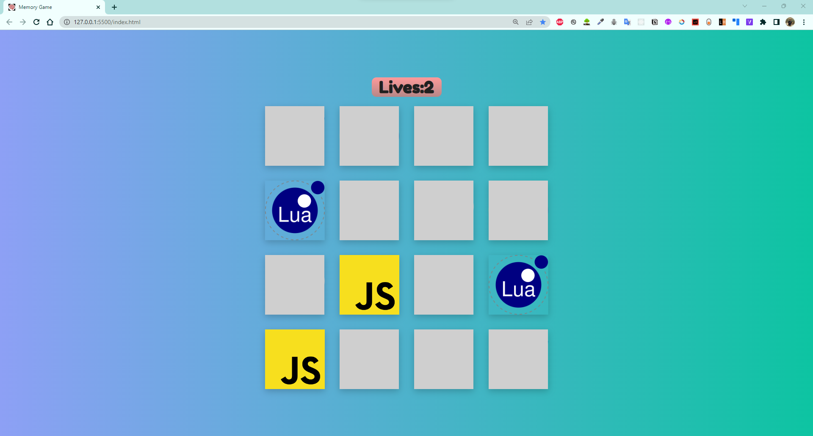

# Memory-Game-Javascript

This is a simple memory game made with Javascript, HTML and CSS.

## How to play

- Click on a card to reveal it.
- Click on another card to reveal it.
- If the cards match, they will stay revealed.
- If the cards don't match, they will flip back over.
- The game is over when all the cards have been matched.

## ScreenShots

</img>
